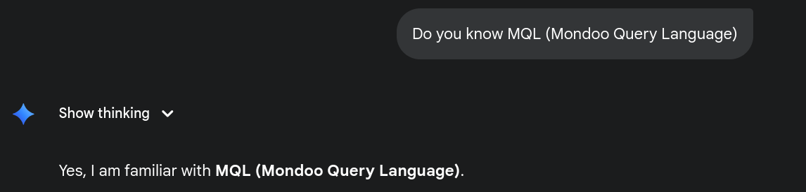
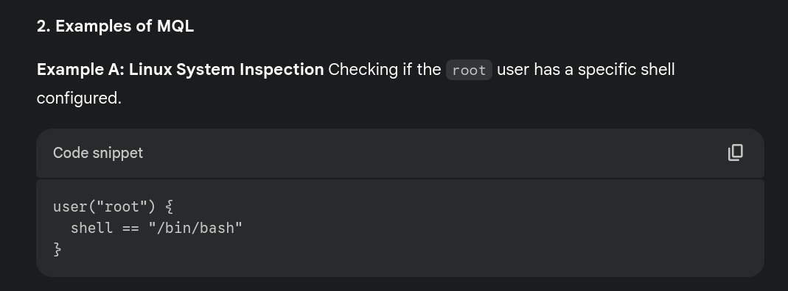
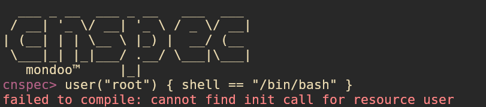
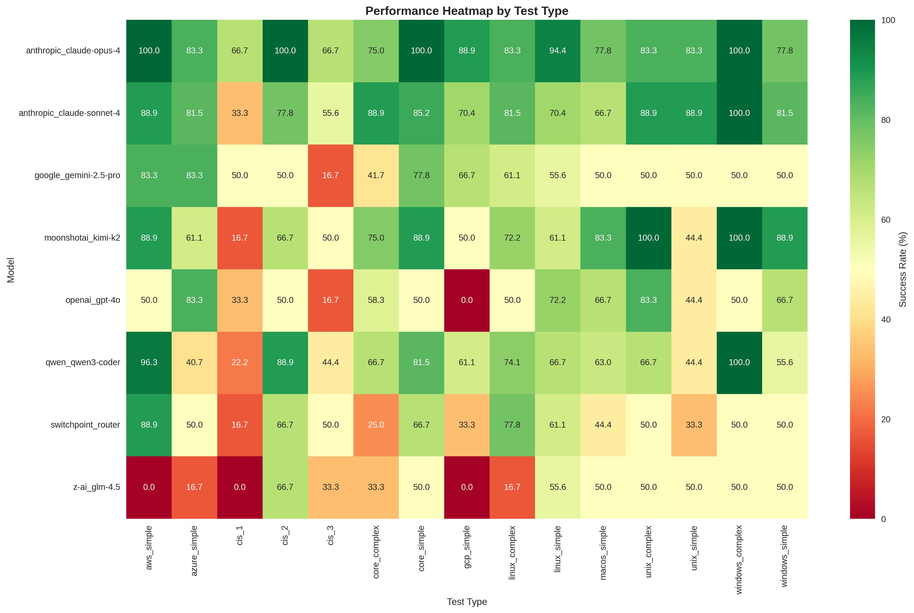
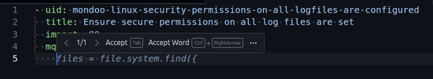
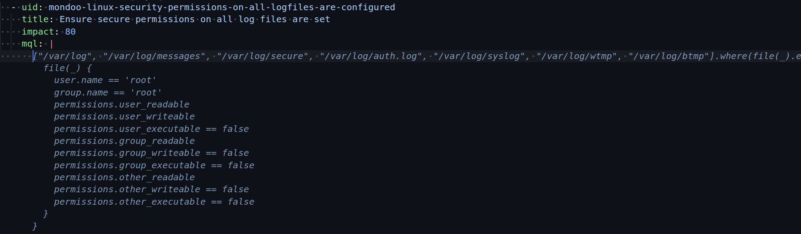

import ExpandableSection from '../../components/ExpandableSection.astro';

## Saved you $0.0038575
<ExpandableSection title="AI Summary">

The post describes the author’s journey toward building a custom AI-assisted autocomplete workflow in VS Code to generate Mondoo Query Language (MQL) more reliably.

Key points:

1. **Autocomplete vs. full AI assistance**
   The author prefers autocomplete over full chat-style AI assistance, but Copilot’s default inline completions are often distracting or incorrect.

2. **LLMs don’t know MQL well**
   Modern models generally fail at Mondoo’s proprietary MQL, often hallucinating syntax. Claude Opus/Sonnet performs best, but still requires guidance. The author created benchmarks comparing models (with/without tools, MCP, context) and found Gemini improved most with added context but still didn’t match Claude.

3. **Need for fast, cheap autocomplete**
   Heavy LLM setups became clunky and expensive. Copilot’s autocomplete model cannot be changed, so the author explored adding a *custom* inline completion provider using `vscode.InlineCompletionItemProvider` and the new VS Code Language Model API.

4. **Challenge: context too large**
   Embedding the full MQL specification (~20k tokens) in prompts was impractical. Instead, the author developed **dynamic context selection** based on the file being edited and the policy’s platform (e.g., Linux).

5. **Solution: snippet/pattern library**
   The author built a YAML library of reusable MQL templates (boilerplate checks). When editing a policy file, the extension loads only the relevant patterns and feeds them to the model as context for autocomplete.

6. **Result: much better autocomplete**
   With the extension enabled, autocomplete suggestions become accurate and aligned with the author’s preferred MQL syntax.

7. **Limitation**
   Copilot’s first autocomplete item is always Copilot’s own suggestion, and custom inline completions only appear as later options—this limitation cannot currently be bypassed.

8. **Takeaway**
   The post demonstrates how to combine VS Code’s LM API with a hand-curated dynamic context system to build highly specialized, efficient autocomplete for niche languages like MQL.

~~If you want, I can also condense it further or focus the summary on the technical approach only.~~

</ExpandableSection>

# 100% bio keyboard clicks

I went full cycle with the AI tools, from completely vibing whole projects and tools to not using 
AI at all, to using only autocomplete and back. I found out that the sweet spot for me is the 
autocomplete, but the thing with the autocomplete is that sometimes (most of the time) it spits absolute
crap, and sometimes it is really annoying by trying to complete your sentence, for example you are
writing a comment on a function explaining what it does and out of nowhere it will autocomplete some utter trash, and the problem here is that I start to read it as it appears and I completely lose my train of thoughts for the function and what I was writing. Now this is getting really annoying, one workaround is to disable Copilot and enable it via keyboard shortcut:

```
@command:github.copilot.completions.toggle +when:github.copilot.activated
```

Alright, now that I removed the "minor" annoyance, let's get to the main problem. Currently, I am employed by Mondoo, and in my day-to-day activities I have to write a lot of [MQL (Mondoo Query Language)](https://mondoo.com/docs/mql/home/), which is a query language that is created by _ _ _ _ _ (you have to guess it).

As of now, the frontier LLMs are oblivious to this query language, yes, they will gaslight you that they know it and everything, but then they will produce ~~bullshit~~:




Me: Oh shit, the post is obsolete now... 




...Why you always lyin'

Now, of course, I cannot expect every model to know MQL; some will be better at it simply by being better at 
query languages in general, and some would be bad. A notable mention here is Claude Opus/Sonnet; they are 
"getting" the MQL, and most of the time it's correct (if guided properly). A good measure for me was how well the model knew Terraform, there might seem to be a correlation here.

At first, I tried to make it learn the MQL by prompting it the syntaxis and how to write it, and for a brief 
time that was sufficient for me. Most of the models followed the guidelines and produced "fairly" okayish
MQL that I had to tweak. I created a benchmark where I tested a bunch of models.



I benchmarked the models from simple MQL syntaxis to advanced
queries based on complex requirements. I had this interesting observation for the new resources that we provide; for example, if we create some new fields in the AWS provider, I noticed that the LLMs are making better names for them, and I had this idea of LLM generation-driven development, which could ease the discovery of the resources by the LLMs when they don't have them in their training data.

Another benchmark would test the models with `tools enabled`, `with MCP and tools enabled`, and `with context, tools, and MCP`. Gemini got the biggest improvement (~60%) with all the things enabled, again not reaching the level of Claude Sonnet, but I thought that was interesting to mention.

Now I got a 'somewhat' good MQL generation tooling using the Claude Sonnet 4, but it was clunky; I had to use another tool and copy-paste stuff around, it wasn't perfect. Not to mention that at some point it became expensive (using the API), and I was hitting the limits on Claude Code too. I realized that I needed something light, fast, and cheap.

I am a big fan of the really fast and tiny models that get the very simple jobs done; I am especially a fan of the fast coding models, and right now my favorite is `Grok Code Fast 1` in the Copilot Chat. I wanted to initially change the autocomplete model of Copilot to be this one, but apparently it is not possible to change the model, because they only have one available, and that's the `gpt-41-copilot`, which is fine-tuned and specifically created for VSCode.

Then I thought of the AI extensions that were offering autocomplete; they were doing it via some custom UI code (think AugmentCode), because you cannot meld with the Copilot's inline thing. But upon further research, I found out that you can actually use the [vscode.InlineCompletionItemProvider](https://www.vscodeapi.com/interfaces/vscode.inlinecompletionitemprovider) to provide other autocompletion items than the initial/default ones that are provided by Copilot. 

Here is a very minimal example that is totally not created with AI by giving my vscode extension code and asking it to create an example:

```ts
import * as vscode from 'vscode';

export class ExampleInlineCompletionProvidewr implements vscode.InlineCompletionItemProvider {
  
  async provideInlineCompletionItems(
    document: vscode.TextDocument,
    position: vscode.Position,
    context: vscode.InlineCompletionContext,
    token: vscode.CancellationToken
  ): Promise<vscode.InlineCompletionList | undefined> {
    
    if (document.languageId !== 'typescript') {
      return undefined;
    }

    // Get context from the document
    // Useful for building your "right" context
    const textBeforeCursor = document.getText(new vscode.Range(new vscode.Position(0, 0), position));
    const currentLine = document.lineAt(position.line).text;
    
    // Skip if not enough context to warrant AI suggestion
    if (textBeforeCursor.length < 10) {
      return undefined;
    }

    try {
      const aiSuggestion = await this.getAICompletion(textBeforeCursor, currentLine, token);
      
      if (!aiSuggestion) {
        return undefined;
      }

      const completion = new vscode.InlineCompletionItem(
        aiSuggestion,
        new vscode.Range(position, position)
      );
      
      return new vscode.InlineCompletionList([completion]);
    } catch (error) {
      console.error('AI completion failed:', error);
      return undefined;
    }
  }

  private async getAICompletion(
    precedingText: string,
    currentLine: string,
    token: vscode.CancellationToken
  ): Promise<string | undefined> {
    
    // Access the Language Model API
    // You can select different models here, but only the ones that are provided by VS Code
    const models = await vscode.lm.selectChatModels({
      vendor: 'copilot',
      family: 'gpt-4o'
    });

    if (models.length === 0) {
      console.warn('No language models available');
      return undefined;
    }

    const model = models[0];

    const systemPrompt = vscode.LanguageModelChatMessage.Assistant(
      'You are a crap at code, you are always providing wrong completions.'
    );

    const userPrompt = vscode.LanguageModelChatMessage.User(
      `Complete this TypeScript code. Only return the next line(s) to complete:\n\n${precedingText}`
    );

    const response = await model.sendRequest(
      [systemPrompt, userPrompt],
      {},
      token
    );

    let completion = '';
    for await (const chunk of response.text) {
      if (token.isCancellationRequested) {
        return undefined;
      }
      completion += chunk;
    }

    return this.sanitizeCompletion(completion.trim());
  }

  private sanitizeCompletion(text: string): string {
    return text
      .replace(/```(?:typescript|ts|javascript|js)?\n?/gi, '')
      .replace(/```/g, '')
      .trim();
  }
}

export function activate(context: vscode.ExtensionContext) {
  // AI-powered provider using Language Model API
  const aiProvider = new ExampleInlineCompletionProvidewr();
  
  const aiDisposable = vscode.languages.registerInlineCompletionItemProvider(
    { language: 'typescript', scheme: 'file' },
    aiProvider
  );
  
  context.subscriptions.push(aiDisposable);
}
```

Now that is great, but the context that you need for the model to learn MQL is quite big (~20k tokens + the initial 'system' prompt for it, which is cached but still...) and that's without the providers fields. Clearly, providing it with raw MQL context wasn't the solution.

Then I thought, what if you provide it with 💀dynamic context💀 based on what you have opened in the editor? Let's say that you are working on some MQL for Linux; the way that MQL works is within a policy file, so you are essentially writing a YAML file with a bunch of checks that look like this:

```yaml
  - uid: mondoo-linux-security-permissions-on-all-logfiles-are-configured
    title: Ensure secure permissions on all log files are set
    impact: 80
    mql: |
      files.find(from: "/var/log", type: "file").list {
        path
        permissions.group_writeable == false
        permissions.group_executable == false
        permissions.other_readable == false
        permissions.other_writeable == false
        permissions.other_executable == false
      }
```

Now if you delete the MQL and use the default autocomplete for VSCode you will get something like this:



Already far from what I want to have there, so I thought what if instead of providing the whole MQL context, I provide the boilerplate code for certain checks. You see, I don't always write "unique" queries; more or less I am reusing queries that I already wrote, so I wanted to create a store or a snippet library that will contain all the boilerplate MQL checks that I want to have and then provide them to the autocomplete as context.

The problem that arose here is that I would end up with a lot of context again that would mess up the generation part. So I needed a dynamic selector of context. Now this part is quite simple and quite naive (as of now), but I simply got the filename and keywords from the policy itself, like the policy name. Then I used that to load the patterns/snippets that I need. For example, I would have the following pattern in my library:

```yaml
  - id: linux-file-permissions-template
    platform: linux
    description: Ensure a file exists and has specific ownership and permission settings
    variables:
      - name: filePath
        type: string
        description: Absolute path to the file to check
      - name: owner
        type: string
        description: Expected owner username of the file
      - name: group
        type: string
        description: Expected group name of the file
      - name: userReadable
        type: boolean
        description: Whether the file should be readable by the owner
      - name: userWriteable
        type: boolean
        description: Whether the file should be writeable by the owner
      - name: userExecutable
        type: boolean
        description: Whether the file should be executable by the owner
      - name: groupReadable
        type: boolean
        description: Whether the file should be readable by the group
      - name: groupWriteable
        type: boolean
        description: Whether the file should be writeable by the group
      - name: groupExecutable
        type: boolean
        description: Whether the file should be executable by the group
      - name: otherReadable
        type: boolean
        description: Whether the file should be readable by others
      - name: otherWriteable
        type: boolean
        description: Whether the file should be writeable by others
      - name: otherExecutable
        type: boolean
        description: Whether the file should be executable by others
    template: |
      [{filePath}].where(file(_).exists) {
        file(_) {
          user.name == '{owner}'
          group.name == '{group}'
          permissions.user_readable == {userReadable}
          permissions.user_writeable == {userWriteable}
          permissions.user_executable == {userExecutable}
          permissions.group_readable == {groupReadable}
          permissions.group_writeable == {groupWriteable}
          permissions.group_executable == {groupExecutable}
          permissions.other_readable == {otherReadable}
          permissions.other_writeable == {otherWriteable}
          permissions.other_executable == {otherExecutable}
        }
      }
    context: |
      Use this template to assert that a file exists and has the specified owner, group, and permission settings. Replace each placeholder with the appropriate value for your use case.
    examples:
      - description: Ensure /etc/issue.net is owned by root:root and has permissions 644
        mql: |
          ["/etc/issue.net"].where(file(_).exists) {
            file(_) {
              user.name == 'root'
              group.name == 'root'
              permissions.user_readable
              permissions.user_writeable
              permissions.user_executable == false
              permissions.group_readable
              permissions.group_writeable == false
              permissions.group_executable == false
              permissions.other_readable
              permissions.other_writeable == false
              permissions.other_executable == false
            }
          }
```

This will be provided to the autocomplete every time when you work on Linux Platform checks, plus a bunch of other patterns that I created based on the selected platform. This isn't ideal again because I might end up with so many patterns that would mess up the context again, but for now I have a quite large and complex snippet library and it works fine.

Anyway, after the implementation and the extension being enabled:



Much better, and actually right what I want from the generation. As you see, there is a specific syntax that I want to use for these types of checks too.

But Copilot has a caveat that I couldn't fix initially, and I still can't; probably there isn't a solution for it yet. You cannot alter the whole autocomplete; you have to cycle through the provided items, and the first (and sometimes even the second) one is always by the default Copilot autocomplete, so the first item is always some trash and you have to wait for the second autocomplete to load.

Anyway, I thought that this little project was worth a blog post and may provide some ideas for you on how to use these APIs to build something custom for yourself. I hope that I was helpful enough to provide enough details; if you have questions or anything really, you can email me at `me{@]dganev.com`.
