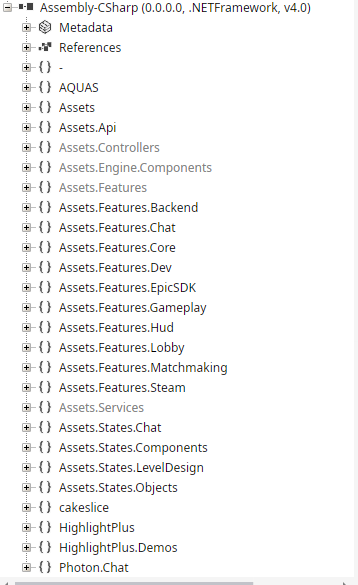
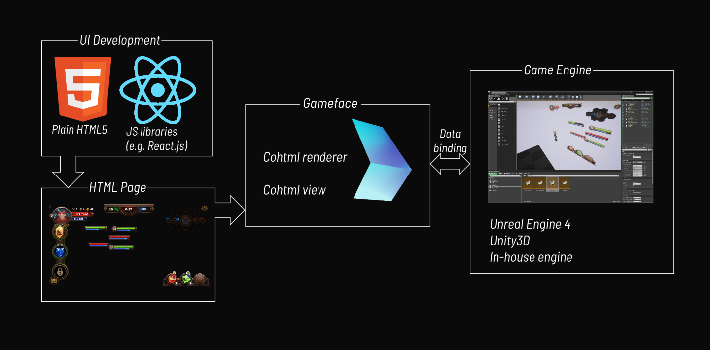
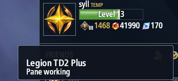
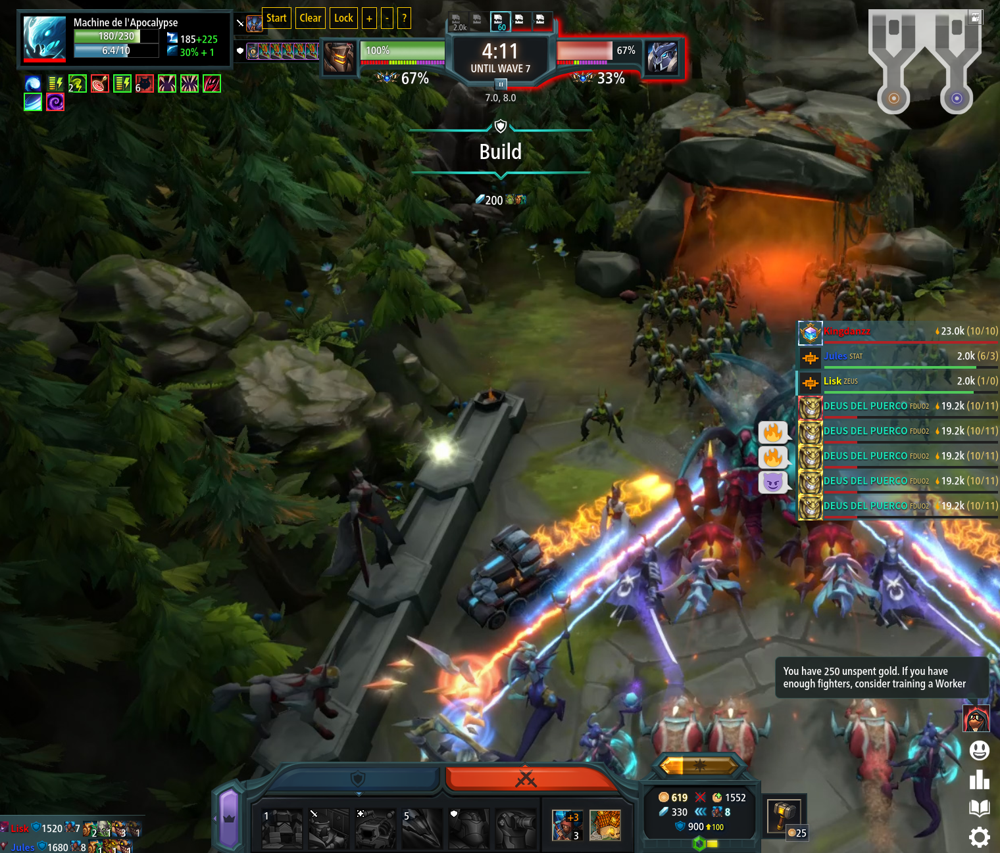
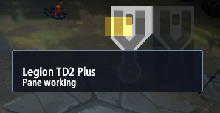

import CodeScript from '../../components/CodeScript.astro';

## Overview

Right, it's been four years since the initial release of my [Go SDK for Legion TD2](/posts/2022-08-23-legiontd2-sdk/). In that time, I've played on and off, but I've never had the time to sit down and write an update or update the tools.

I am currently between jobs, so I took some time to chill out and basically do whatever I like and here I am with this blog post.

<i>*sigh* In the ERA OF AI *sigh* blah blah blah</i> you can code faster; you know the drill. I realized that I could come up with some better analytical tools for LegionTD. I am really grateful for the work of [Drachir and Drachbot](https://drach.bot/) for showing me what's possible. I've played Dota 2 for a while, and I thought about creating something like Dota Plus, but for Legion TD. Dota Plus is basically a service that provides the user with analytical information about the game. For example, it can show which spells most people at your rank picked first during the very first levels and which items most people bought first. This is good stuff when you are a newer player and have never played that hero. Technically, the "guides" provide the same information, but they don't take the enemy heroes, lane/role, and so on into consideration.

First, I am not a high-Elo player, so apologies if some of this stuff looks useless to you. The whole idea of this project was to help me play better.

[Current stats](https://drach.bot/profile/syll/)

## How Would Legion TD Plus Work?

The first problem I have is figuring out how to get information from the current match. In Dota, this would be incorporated into the game, but Legion has no such thing. Without knowing too much, my first thought was to read the current process and locate the offsets of the data that I need. I went on to investigate how I would do that, which is when I discovered that the game is written in Unity.

I did some research to see whether there was an easier way to do it without using offsets, and it turns out there is: welcome to [BepInEx 5](https://github.com/BepInEx/BepInEx/tree/v5-lts). This article uses BepInEx 5, which is also the major version used by the existing Legion TD2 mods I studied.

TLDR: `BepInEx is a plugin / modding framework for Unity Mono, IL2CPP and .NET framework games (XNA, FNA, MonoGame, etc.)`

Fortunately, BepInEx can be used to create a "plugin" for it. I've explored a bunch of mods that were already created for it, like [Narrow Master Minded](https://github.com/LegionTD2-Modding/NarrowMasterMinded).

## Building it

I have the basic building blocks, so how do I connect and use them?

Since I am using Linux and playing the game through Proton, I had to do some additional setup. I need to tell Proton to load it via `winhttp.dll`, as described in the [Proton configuration guide for Linux](https://github.com/LegionTD2-Modding/.github/wiki/Configure-Proton-for-Linux). I am running it through Steam, so it's a bit easier on my side: just use these launch options: `WINEDLLOVERRIDES="winhttp=n,b" %command%`.

Now, onto how and why I am using `winhttp.dll`. Initially, I was very confused: why this particular DLL, and how on earth did it appear in my game directory? Was it there to begin with? The confusion arose because I used AI to skip this process and focus on other things, such as features in the mod. Anyway, I did some research on my own and realized that this is actually [UnityDoorstop](https://github.com/NeighTools/UnityDoorstop)'s way of adding .NET assemblies to Unity. It uses `winhttp.dll` to "sideload" another DLL into Unity. As for why it uses `winhttp.dll` specifically, the answer is simple: the game supports and expects it. Sure, I can use other proxies from [UnityDoorstop's supported proxy list](https://github.com/NeighTools/UnityDoorstop/blob/master/src/windows/proxy/proxylist.txt), but the idea is that the game must already use them.

Onto the next thing: I need to create a config file for Doorstop. I use the [example `doorstop_config.ini`](https://github.com/NeighTools/UnityDoorstop/blob/master/assets/windows/doorstop_config.ini) from the repository. I just need to adjust `target_assembly` to point to the BepInEx runtime DLL.

The BepInEx installation already does this for me, but I wanted to explain more clearly how it loads everything.

## BepInEx

`doorstop_config.ini` has a `target_assembly` that points directly to `BepInEx.dll`. Why doesn't it point directly to my built Unity plugin? Because BepInEx saves me from reimplementing plugin discovery, dependency ordering, configuration, logging, and the startup hooks needed to create my plugin as a Unity component. Once that component exists, Unity calls its `Awake()` method, and my code runs after that.

I should point the preloader in my configuration:

```
# doorstop_config.ini
target_assembly=BepInEx\core\BepInEx.Preloader.dll
```

### Unity Plugin

I need the bare bones of a Unity plugin, so I've used the [BepInEx 5 plugin tutorial](https://docs.bepinex.dev/v5.4.11/articles/dev_guide/plugin_tutorial/2_plugin_start.html) to set up a project.

```csharp
# Plugin.cs
using BepInEx;

namespace LtdPlusPlugin;

// Optionally, I can add process filtering with `BepInProcess`
[BepInProcess("Legion TD 2.exe")]
[BepInPlugin(PluginInfo.PLUGIN_GUID, PluginInfo.PLUGIN_NAME, PluginInfo.PLUGIN_VERSION)]
public class Plugin : BaseUnityPlugin
{
    private void Awake()
    {
        Logger.LogInfo($"{PluginInfo.PLUGIN_NAME} ({PluginInfo.PLUGIN_VERSION}) is loaded!");
    }
}
```

Okay, I can run `dotnet build -c Release`, and I will have a `DLL` that serves as a base plugin for the game. However, I still haven't loaded anything into the game because I have a standalone DLL. Using the knowledge that I have already gathered, I should extract the appropriate BepInEx 5 package into the game directory. The [BepInEx releases](https://github.com/BepInEx/BepInEx/releases) include prebuilt binaries that I can use. After adding my plugin, the relevant files should look like this:

```
~/.local/share/Steam/steamapps/common/Legion TD 2/
    doorstop_config.ini
    winhttp.dll
    BepInEx/
        core/
            BepInEx.Preloader.dll
            BepInEx.dll
        plugins/
            LtdPlusPlugin.dll
```

Now I am ready to test whether my plugin loads. As I said earlier, I am using Linux, and the automatic discovery of DLLs that is usually handled by Windows isn't happening on my end. In that case, I need to inject `winhttp.dll` using `WINEDLLOVERRIDES`.

When I load the game and check the BepInEx logs, I should see:

```
[Info   :   BepInEx] Loading [LegionTD2 Plus 0.1.0]
[Info   :LegionTD2 Plus] LegionTD2 Plus (0.1.0) is loaded!
```

# Figuring out how it should work

I am completely new to Unity, let alone decompiling and reverse engineering. While I know some basic stuff, bear with me here :D.

I discovered the use of "Harmony" through [ModsGate](https://github.com/LegionTD2-Modding/ModsGate/). It was my first time hearing about this library, so I had to research it too. On top of that, I am also quite inexperienced with C#.

I realized that I need to decompile part of the game. The main game code is in `/Managed/Assembly-CSharp.dll`, and this is what I see when I decompile it with `ILSpy`:



My initial idea was simply to draw on the screen as an "overlay," so my best guess was that I needed to look at how the game draws things on the screen and how it all works together. While reading through the decompiled code, I saw `using Coherent.UIGT;`. As a random Reddit user described it:

> CoherentUI is a user interface system that Pearl Abyss decided to use in Black Desert to help make their interface. It allows you to make it with things like HTML, CSS, and Javascript etc. Its sort of like embedding a browser and using it as a UI. The reason why there are multiple processes is because the nature of CoherentUI is to break up tasks in a multi-process architecture to multitask. Its a similar reason why Chrome splits up its processes.
>
> [Shadowraix](https://www.reddit.com/user/Shadowraix/), in ["What exactly is the Coherent UI?"](https://www.reddit.com/r/blackdesertonline/comments/5saam7/what_exactly_is_the_coherent_ui/)



Okay, conceptually, I get it, but implementing this involved a bunch of back-and-forth with AI about what everything is and why it works that way. Eventually, I got it:

What I needed to do first was get the types of the HUD controller, the API, and the `Main` type of Assets.

```csharp
private readonly Type? _hudControllerType = AccessTools.TypeByName("Assets.Controllers.HudController");
private readonly Type? _hudApiType = AccessTools.TypeByName("Assets.Api.HudApi");
private readonly Type? _mainType = AccessTools.TypeByName("Assets.Main");
```

I am going to use those to subscribe to the `Assets.Main.OnRender` event. Then, I am going to use a `Delegate` to subscribe to that event and add an event handler. This handler will be the function I use to check whether the HUD is initialized and whether I can continue with the "drawing."

In the end, the code will look like this:

<CodeScript title="HUD Installer" filename="HudInstaller.cs" lang="csharp" defaultOpen={true}>
{`
using System;
using System.Reflection;
using BepInEx.Logging;
using HarmonyLib;

namespace LtdPlusPlugin;

internal sealed class HudInstaller(ManualLogSource log) : IDisposable
{
    private readonly Type? _hudControllerType = AccessTools.TypeByName("Assets.Controllers.HudController");
    private readonly Type? _hudApiType = AccessTools.TypeByName("Assets.Api.HudApi");
    private readonly Type? _mainType = AccessTools.TypeByName("Assets.Main");
    private readonly ManualLogSource _log = log;
    private EventInfo? _renderEvent;
    private Delegate? _renderHandler;
    private bool _installed;

    public void Start()
    {
        if (_hudControllerType is null || _hudApiType is null || _mainType is null)
        {
            _log.LogError("HudInstaller: _hudControllerType is null || _hudApiType is null || _mainType is null");
            return;
        }

        var callback = GetType().GetMethod(nameof(OnRender), BindingFlags.Instance | BindingFlags.NonPublic);

        if (callback is null)
        {
            _log.LogError("HudInstaller: cannot assert type on OnRender callback");
            return;
        }

        _renderEvent = _mainType.GetEvent("OnRender", BindingFlags.Public | BindingFlags.Static);


        if (_renderEvent?.EventHandlerType is null)
        {
            _log.LogError("HudInstaller: cannot assert type on _renderEvent");
            return;
        }

        _renderHandler = Delegate.CreateDelegate(_renderEvent.EventHandlerType, this, callback);
        _renderEvent.AddEventHandler(null, _renderHandler);
    }

    private bool TryInstall()
    {
        if (_hudControllerType is null)
        {
            return false;
        }
        var loadedValue = HarmonyHelpers.ReadStaticMember(_hudControllerType, "Loaded");
        if (loadedValue is not bool loaded)
        {
            _log.LogError("HudInstaller: HudController.Loaded is missing or is not a bool");
            return false;
        }
        if (!loaded)
        {
            return false;
        }
        _installed = true;
        _log.LogInfo("HudInstaller: installed");
        return true;
    }

    private void OnRender()
    {
        if (_installed)
        {
            return;
        }
        if (!TryInstall())
        {
            return;
        }
        Dispose();
    }

    public void Dispose()
    {
        if (_renderEvent is null)
        {
            _log.LogError("HudInstaller: cannot dispose the event handler");
            return;
        }
        _renderEvent.RemoveEventHandler(null, _renderHandler);
    }
}
`}
</CodeScript>

Once I compile the plugin and load the game, I should see this in the logs:

```
[Info   :LegionTD2 Plus] HudInstaller: installed
```

# Drawing on the screen

The next logical step is to figure out how to draw on the screen. I've tried a few variants, and I did not like any of them because they required patching the game files, which means the changes would be replaced or lost after each update (technically true when doing it without patching in this case too, but it is still a bit less fragile). [In the end](https://www.youtube.com/watch?v=eVTXPUF4Oz4), I've bundled my overlay 'resources' into the DLL. I use the reflected `ExecuteScript` method from the `Coherent` view to install the CSS and JS that I've created.

I am back to using reflection and the `Harmony` library, which will get me the game methods that I need to draw on the screen. So, in `TryInstall()`, I have:

```csharp
var view = HarmonyHelpers.ReadStaticMember(_hudApiType!, "savedView");
if (view is null)
{
    return false;
}
//...
var executeScript = view.GetType().GetMethod("ExecuteScript", [typeof(string)]);
if (executeScript is null)
{
    _log.LogError("HudInstaller: Coherent view does not have ExecuteScript");
    _installFailed = true;
    return false;
}
var javascript = ReadResource("LtdPlusPlugin.hud.js");
var css = ReadResource("LtdPlusPlugin.hud.css");
//...
var escapedCss = css
    .Replace("\\", "\\\\")
    .Replace("'", "\\'")
    .Replace("\r", "\\r")
    .Replace("\n", "\\n");

var installStyle =
    "var oldStyle = document.getElementById('ltdplus-style');" +
    "if (oldStyle) oldStyle.parentNode.removeChild(oldStyle);" +
    "var style = document.createElement('style');" +
    "style.id = 'ltdplus-style';" +
    $"style.textContent = '{escapedCss}';" +
    "document.head.appendChild(style);";

try
{
    _ = executeScript.Invoke(view, [installStyle + javascript]);
}
catch (Exception exception)
{
    _log.LogError($"HudInstaller: could not execute HUD script: {exception}");
    return false;
}
```

That is how I 'inject' my JS/CSS HUD into the existing HUD without having to replace any game files.



# Game States

I certainly do not want to display the pane on the main menu, since it blends into the existing UI and doesn't provide much at the moment. I want to do that in-game, but how do I get that information, and how do I "know" that I am in a game?

That was simple enough. When you explore the game files here: `Legion TD 2_Data/uiresources/AeonGT/gateway.html`, you can see that `gateway.html` is actually the main menu. You can even open it and see a demo of the UI, with the current user being [Lisk](https://steamcommunity.com/id/liskgg). Shout-out to him for making that great map and game :)

You can click around and inspect the full in-game UI:



I can already notice a couple of interesting things that I had never seen in the game. The first was the "find me a match as soon as possible" button while queuing, and the next was the win probability based on the power score below the king's HP and upgrades.

Anyway, I track the current view state using the `Assets.Api.HudApi.CurrentView` method. The current views are:

> Note: These are derived from `app.js`. I can inspect `bindings.loadView` and see the switch cases.

```
- "gateway" - startup
- "launcher" -main menu
- "loading" -match loading screen
- "pregame" -pregame selection
- "game" -active in-game HUD
- "gamemenu" - Escape/pause menu
- "postgame" - results screen
```

I want my custom pane to load during the "game" view. This required me to rethink how I shaped my `HudInstaller`: instead of subscribing to `OnRender`, I could simply subscribe to `HudApi.OnLoadView` and create a callback for whenever I receive the `game` state.

```csharp
var callback = GetType().GetMethod(nameof(OnViewChanged), BindingFlags.Instance | BindingFlags.NonPublic);
_loadViewEvent = _hudApiType.GetEvent("OnLoadView", BindingFlags.Public | BindingFlags.Static);
// Adding the callback & event handler:
_loadViewHandler = Delegate.CreateDelegate(_loadViewEvent.EventHandlerType, this, callback);
_loadViewEvent.AddEventHandler(null, _loadViewHandler);
//...
private void OnViewChanged(string viewName)
{
    if (string.Equals(viewName, GameView, StringComparison.OrdinalIgnoreCase))
    {
        if (!_installed)
        {
            TryInstall();
        }

        return;
    }

    if (_installed)
    {
        Remove();
    }
}
```

> Note: This caused a `NullReferenceException` because the Unity resources weren't ready when I subscribed to the event. The correct way to handle this is to wait until `HudController.Loaded` is `true` and only then subscribe to `HudApi.OnLoadView`.

With that in mind, I add a method that tells me when the HUD is ready:

```csharp
private bool IsHudLoaded()
{
    var loadedValue = HarmonyHelpers.ReadStaticMember(_hudControllerType!, "Loaded");
    if (loadedValue is bool loaded)
    {
        return loaded;
    }

    _log.LogError("HudInstaller: HudController.Loaded is missing or is not a bool");
    _stopped = true;
    return false;
}
//...
private void OnRender()
{
    if (_stopped)
    {
        return;
    }

    if (_loadViewHandler is null)
    {
        if (!IsHudLoaded())
        {
            return;
        }

        if (!SubscribeToViewChanges())
        {
            _stopped = true;
            return;
        }
    }

    if (string.Equals(_currentView, GameView, StringComparison.OrdinalIgnoreCase))
    {
        if (!_installed)
        {
            TryInstall();
        }

        return;
    }

    if (_installed)
    {
        Remove();
    }
}
```

Now, when I enter a game, the overlay is shown:



At this point, I have a base plugin/overlay that I can use in-game to show me some "plus" content.

# The End (of first part)

I will mark this as the end of the project's first part because it's already too long, and some of you might find it boring. Thank you for reading. In the second part, I will discuss the game itself, how it works, and what information and features will be useful to me. I plan to build out the overlay conceptually in that part.
